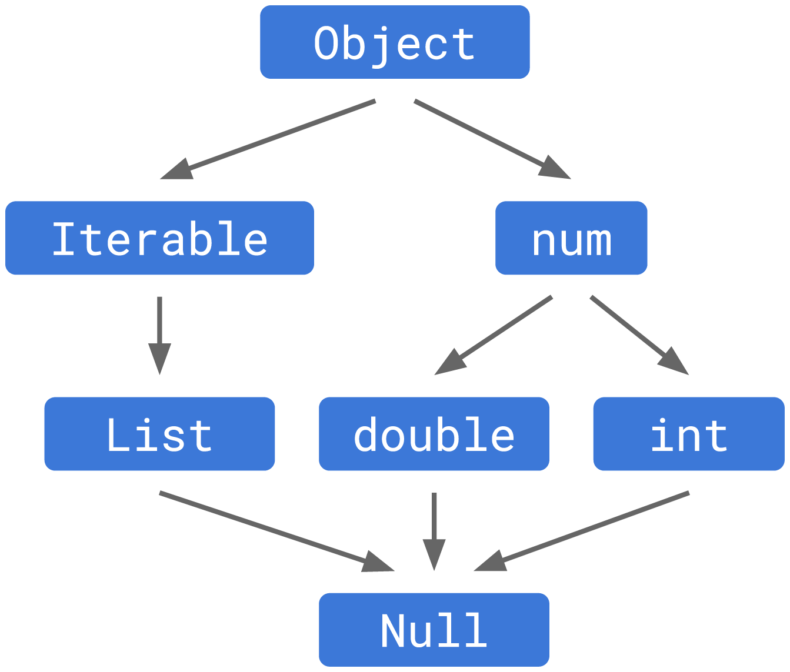

# Introduction to Dart

## Cairo University GDSC, 2021

<br>
<br>

**Note**: Most of the examples here are from the [dart docs](https://dart.dev/guides).

## Roadmap

- Data Types
- Conditions
- Loops
- Null Safety
- Functions
- OOP

<br>
<br>

## Data Types

| Data Type             | Keyword                                                                  | Description                                   |
| :-------------------- | :----------------------------------------------------------------------- | :-------------------------------------------- |
| Number                | [num](https://api.dart.dev/stable/2.14.4/dart-core/num-class.html)       | An integer or floating-point number.          |
| Integer               | [int](https://api.dart.dev/stable/2.14.4/dart-core/int-class.html)       | An integer number.                            |
| Floating-point Number | [double](https://api.dart.dev/stable/2.14.4/dart-core/double-class.html) | A floating point number.                      |
| Strings               | [String](https://api.dart.dev/stable/2.14.4/dart-core/String-class.html) | A sequence of UTF-16 code units (Characters). |
| Booleans              | [bool](https://api.dart.dev/stable/2.14.4/dart-core/bool-class.html)     | represents Boolean values true and false      |
| Lists                 | [List](https://api.dart.dev/stable/2.14.4/dart-core/List-class.html)     | An indexable collection of objects            |
| Sets                  | [Set](https://api.dart.dev/stable/2.14.4/dart-core/Set-class.html)       | A collection of unique objects.               |
| Maps                  | [Map](https://api.dart.dev/stable/2.14.4/dart-core/Map-class.html)       | A collection of key/value pairs.              |

<br>

### `num`, `int`, `double`

```dart
  // declare a num, can hold an integer value or floating point value
  num aNumber = 1.5;

  // declare an integer, can hold only integer values
  int anInt = 2;

  // declare a double value, can hold only floating point values
  double aDouble = 1.5;

  // use when you don't know the type of string
  var a1 = num.parse("1.1"); // a1 = 1.1

  // b1 is of type [int]
  var b1 = int.parse("2"); // b1  = 2
  // var b2 = int.parse("2.2"); // ERROR. cannot parse a string double using int

  // c1 is of type [double]
  var c1 = double.parse("2.34"); // c1 = 2.34
  var c2 = double.parse("2"); // Valid. c2 = 2.0 (with .0 because it's a double)
```

### `String`

```dart
'Single quotes';
"Double quotes";
'Double quotes in "single" quotes';
"Single quotes in 'double' quotes";

// multiline strings perserve spaces and lines
'''A
multiline
string''';

"""
Another
multiline
string""";
```

Strings are immutable. Although you cannot change a string, you can perform an operation on a string which creates a new string:

```dart
var string = 'Dart is fun';
var newString = string.substring(0, 4); // Dart
```

You can use the plus (+) operator to concatenate strings:

```dart
'Dart ' + 'is ' + 'fun!'; // 'Dart is fun!'
```

Adjacent string literals are concatenated automatically:

```dart
'Dart ' 'is ' 'fun!';    // 'Dart is fun!'
```

You can use ${} to interpolate the value of Dart expressions within strings. The curly braces can be omitted when evaluating identifiers:

```dart
string = 'dartlang';
'$string has ${string.length} letters'; // 'dartlang has 8 letters'
```

A string is represented by a sequence of Unicode UTF-16 code units accessible through the codeUnitAt or the codeUnits members:

```dart
string = 'Dart';
string.codeUnitAt(0); // 68
string.codeUnits; // [68, 97, 114, 116]
```

### `List`

Subclasses of this class implement different kinds of lists. The most common kinds of lists are:

- Fixed-length list. An error occurs when attempting to use operations that can change the length of the list.

- Growable list. Full implementation of the API defined in this class.

```dart
// declare a fixed list with .filled constructor, cannot change it size
var fixedLengthList = List<int>.filled(5, 0);
fixedLengthList.length = 0;  // Error
fixedLengthList.add(499);    // Error
fixedLengthList[0] = 87;

// declare a growable list with [],
var growableList = [1, 2];
growableList.add(499); // [1, 2, 499]
growableList.length = 0; // []
growableList[0] = 87; // RangeError: invalid value. list is empty, so there are no elements at index 0
```

### `Map`

There is a finite number of keys in the map, and each key has exactly one value associated with it.

Maps, and their keys and values, can be iterated. The order of iteration is defined by the individual type of map. Examples:

- The plain [HashMap](https://api.dart.dev/stable/2.14.4/dart-collection/HashMap-class.html) is unordered (no order is guaranteed),
- the [LinkedHashMap](https://api.dart.dev/stable/2.14.4/dart-collection/LinkedHashMap-class.html) iterates in key insertion order,
- and a sorted map like [SplayTreeMap](https://api.dart.dev/stable/2.14.4/dart-collection/SplayTreeMap-class.html) iterates the keys in sorted order.

```dart
// Declaring a Map using a Map Constructor
Map<String, int> aMap = new Map();

// Declaring a Map using Map Literals
var anotherMap = <String, int>{};

// add an entry to the map
anotherMap["myKey"] = 10;

// or using addEntries method, note it take a list of [MapEntry]
anotherMap.addEntries([MapEntry("anotherKey", 20)]);
```

### `Set`

The set is equivalent to one created by [`LinkedHashSet<E>()`](https://api.dart.dev/stable/2.14.4/dart-collection/LinkedHashSet-class.html).

```dart
// Declaring a set of integers using the Set constructor
Set<int> aSet = Set();

// Declaring a Set using Set Literals.
// note that to avoid ambiguity with Map literals
// you must explicitly specify a type when creating an empty set.
var anotherSet = <int>{};

anotherSet.add(100);
anotherSet.add(20);
anotherSet.add(60);
print("Default implementation :${anotherSet.runtimeType}"); // _CompactLinkedHashSet<int>


// all elements are retrieved in the order in which they are inserted
for (var element in anotherSet) {
  print(element);
} // 100, 20, 60
```

<br>

## Conditions

### `if statement`

```dart
int i = 2;

if (i == 5) {
  print("$i");
} else if (i > 5) {
  print("$i is greater than 5");
} else {
  print("$i is less than 5");
} // 2 is less than 5
```

### `switch case`

```dart
var grade = "A";
switch(grade) {
  case "A": {  print("Excellent"); } // Excellent
  break;

  case "B": {  print("Good"); }
  break;

  case "C": {  print("Fair"); }
  break;

  case "D": {  print("Poor"); }
  break;

  default: { print("Invalid choice"); }
  break;
}
```

<br>

## Loops

### `for`

```dart
// loop from 0 to 4
for (var i = 0; i < 4; i++) {
  print('$i');
} // 0 ,1 ,2 ,3
```

### `while`

```dart
var num = 5;
var factorial = 1;

// while loop
while (num >= 1) {
  factorial = factorial * num;
  num--;
}
print(factorial); // 120
```

### `do while`

Difference between `while` and `do while` is that do while will excute the code inside body at least once

```dart
var n = 10;
// do while
do {
  // print(n);
  n--;
} while (n >= 0);
```

<br>

## [Null Safety](<(https://dart.dev/codelabs/null-safety)>)

### Without null safety

```dart
// @dart = 2.9

bool isEmpty(String string) {
  return string.length == 0;
}

main() {
  isEmpty(null); // throws a NoSuchMethodError exception on the call to .length.
}
```

If you run this Dart program without null safety, it throws a `NoSuchMethodError` exception on the call to `.length`. The `null` value is an instance of the `Null` class, and `Null` has no “length” getter. Runtime failures suck. This is especially true in a language like Dart that is designed to run on an end-user’s device. If a server application fails, you can often restart it before anyone notices. But when a Flutter app crashes on a user’s phone, they are not happy. When your users aren’t happy, you aren’t happy.

<br>

### **Sound Null Safety**

When you opt into null safety, types in your code are non-nullable by default, meaning that **variables can’t contain null unless you say they can.** With null safety, your runtime null-dereference errors turn into edit-time analysis errors.

With null safety, all of the variables in the following code are non-nullable:

```dart
// In null-safe Dart, none of these can ever be null.
var someInt = 42; // Inferred to be an int.
String message = "Dart is Cool";

// someInt = null // ERROR! A value of type 'Null' can't be assigned to a variable of type 'int'.
```

To indicate that a variable might have the value null, just add ? to its type declaration:

```dart
int? aNullableInt = 30;
aNullableInt = null; // Valid
```

So If you run the above the example again with null safety enabled, you'll get an analysis error.

```dart
bool isEmpty(String string) {
  return string.length == 0;
}

main() {
  isEmpty(null); //analyzer Error! The argument type 'Null' can't be assigned to the parameter type 'String'
}
```

Note that the parameter of `isEmpty` is of type `String` not `String?`. So it cannot accept `null`.
<br>
<br>

Before Null Safety, the `Null` type was treated as a subtype of all types (left figure) .Null safety eliminates that problem at the root by changing the type hierarchy. The `Null` type still exists, but it’s no longer a subtype of all types (right figure).

|                                    Hierarchy before                                    |                                   Hierarchy after                                    |
| :------------------------------------------------------------------------------------: | :----------------------------------------------------------------------------------: |
|  |  |

Since Null is no longer a subtype, no type except the special Null class permits the value null. We’ve made all types non-nullable by default. If you have a variable of type String, it will always contain a string. There, we’ve fixed all null reference errors.

It’s as if we’ve taken the universe of types in your program and split them into two halves:


There is a region of non-nullable types. Those types let you access all of the interesting methods, but can never ever contain null. And then there is a parallel family of all of the corresponding nullable types. Those permit `null`, but you can’t do much with them. We let values flow from the non-nullable side to the nullable side because doing so is safe, but not the other direction.

<br>

### **Null Assertion**

The null assertion operator (!)

If you’re sure that an expression with a nullable type isn’t null,
you can use a null assertion operator (!) to make Dart treat it as non-nullable.
By adding ! just after the expression, you tell Dart that the value won’t be null,
and that it’s safe to assign it to a non-nullable variable.

**NOTE!** If you’re wrong, Dart throws an exception at run-time.
This makes the ! operator unsafe, so don’t use it unless you’re very sure
that the expression isn’t null.

```dart
List<int?> listThatCouldHoldNulls = [2, null, 4];
// add (!) at the end to tell the compiler that first is not null
int b = listThatCouldHoldNulls.first!;
```

Note that **b** is a non-nullable `int`, and the list you're accessing can contain nullable `int`s, so to tell dart that the value is not null, add `!` after the object you're trying to assign to **b**.

<br>

### **Null safety principles:**

Dart null safety support is based on the following three core design principles:

- **Non-nullable by default**. Unless you explicitly tell Dart that a variable can be null, it’s considered non-nullable. This default was chosen after research found that non-null was by far the most common choice in APIs.

- **Incrementally adoptable.** You choose what to migrate to null safety, and when. You can migrate incrementally, mixing null-safe and non-null-safe code in the same project. We provide tools to help you with the migration.

- **Fully sound.** Dart’s null safety is sound, which enables compiler optimizations. If the type system determines that something isn’t null, then that thing can never be null. Once you migrate your whole project and its dependencies to null safety, you reap the full benefits of soundness — not only fewer bugs, but smaller binaries and faster execution.

### **Enabling null safety**

Sound null safety is available in Dart 2.12 and Flutter 2. Use [this](https://dart.dev/null-safety/migration-guide) guide to migrate to null safety.

<br>

More info about Null Safety here [Understanding Null Safety](https://dart.dev/null-safety/understanding-null-safety)
